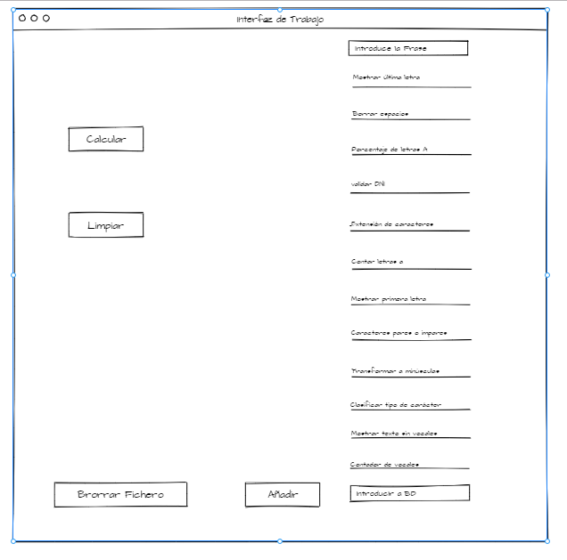

# Introducción

Repositorio para practicar con desarrollo ágil Scrum
Ver el fichero [CONTRIBUTING.md](CONTRIBUTING.md). para saber como colaborar con el proyecto

# Montaje del servidor de Base de Datos MySQL usando docker

Usaremos los siguientes comandos:
- Descargamos la imagen de MySQL
> docker pull mysql:5.7
- Iniciamos la imagen para crear el servidor
> docker run -d -p 3306:3306 --name mysql4 -e MYSQL_ROOT_PASSWORD=Ad1234 mysql:5.7 --character-set-server=utf8mb4 --collation-server=utf8mb4_unicode_ci
- Y por ultimo iniciamos el servidor
> docker start mysql4
- Entrar en mysql
> docker exec -it mysql4 mysql -uroot -p

_Contraseña del servidor: Ad1234_

# Mockup borrador 

# Datos web hosting
